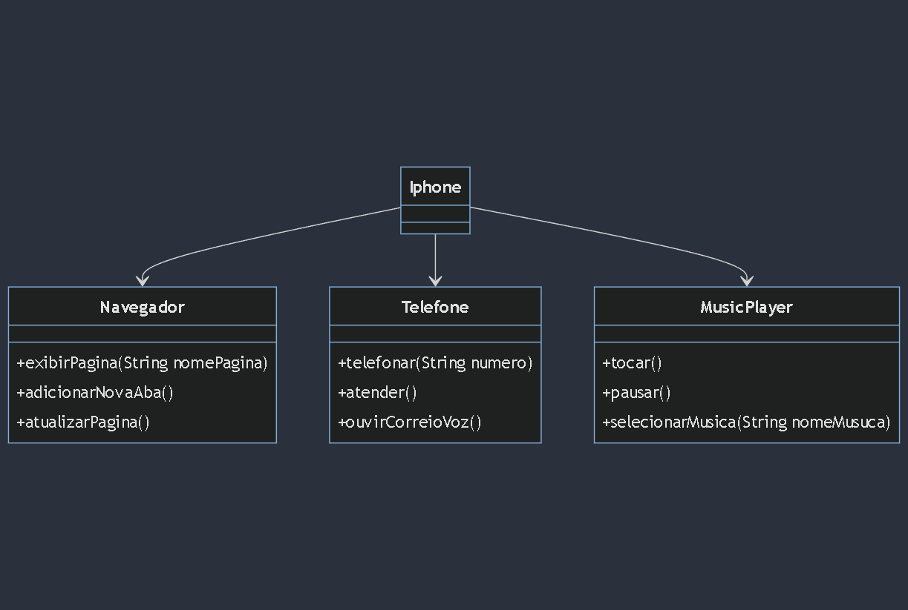

## Trabalho prático para estudar UML e Orientação a objetos

O projeto se resume a modelar e diagramar a representação UML de um Iphone abrangendo as funcionalidades de Reprodutor Musical, Aparelho Telefônico e Navegador na Internet.

Diagrama UML feito:

